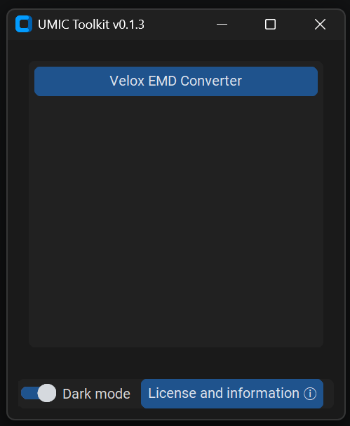
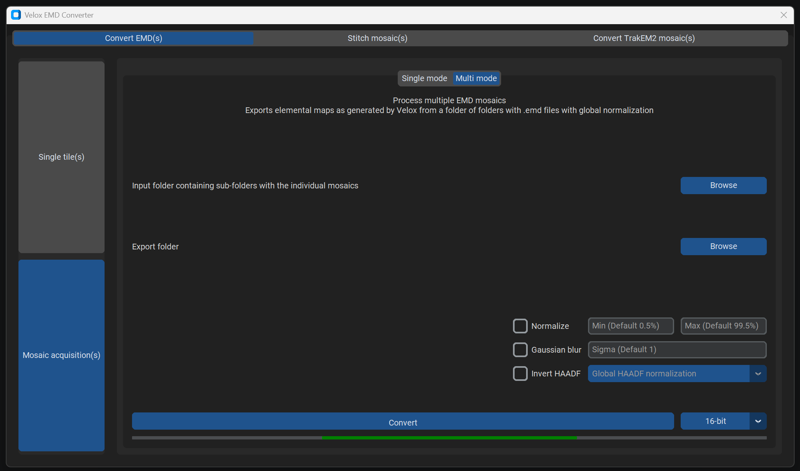

# UMIC_Toolkit
Common custom Python scripts used for UMIC-related workflows. These workflows have been translated to a GUI for accessibility. Note this is still work-in-progress.
<p align="center"></p>

## Modules
### EMD Converter
Extracts elemental maps as .tiff files from .emd files, provides instructions for stitching using TrakEM2 and enables converson to .ome.tiff-files.
<p align="center"></p>

## Usage
The GUI can be launched from the command line or packaged into an .exe. First the appropriate environment will have to be created and the repository has to be cloned.

### Create environment
Create a <a href =https://docs.conda.io/en/latest/> conda</a> environment.

```bash
conda create --name environment_name
```

Activate the conda environment.
```bash
conda activate environment_name
```

### Clone the repository
Create a directory where you want a clone of the repository and navigate to it.
For example:

```bash
cd "D:/Github/UMIC_Toolkit"
```

Clone the repository.

```bash
git clone https://github.com/BHPD/UMIC_Toolkit.git
cd UMIC_Toolkit
```

### Install packages
Install the required packages using the requirements.txt file.

```bash
conda install --file requirements.txt
```
<i>Note this requirements.txt is not available yet</i>

### Launch GUI
Activate the appropriate environment.
Navigate to the directory where the repository is cloned.
```bash
python main.py
```

### (Optional) package the GUI into a .exe for convenience
Change the build.spec file such that the relevant absolute paths are correct for your computer.
Using PyInstaller:
```bash
pyinstaller build.spec --clean
```


